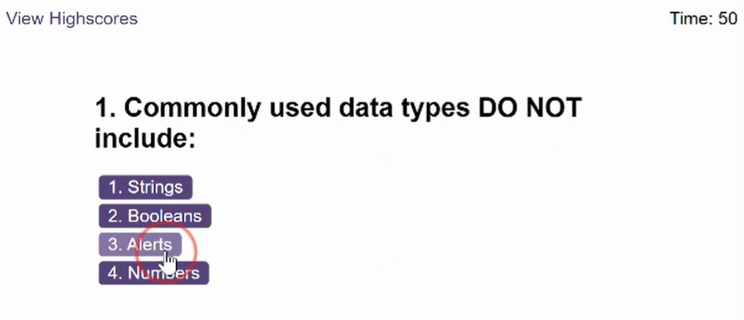
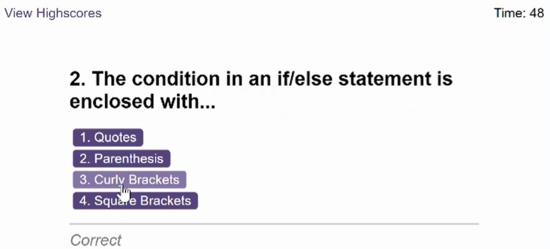
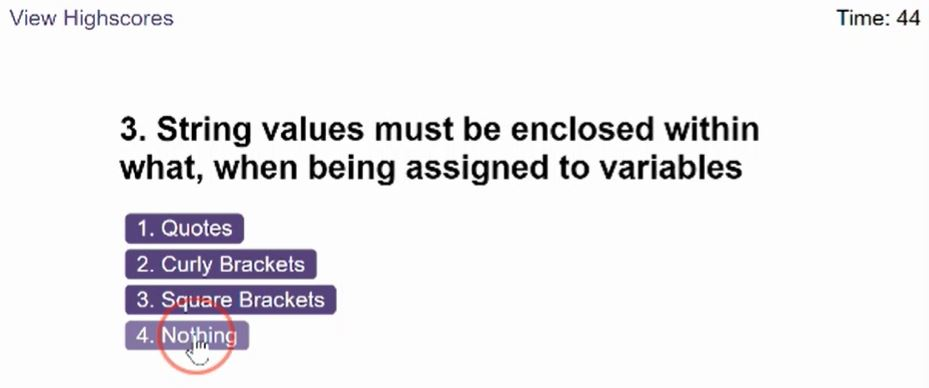
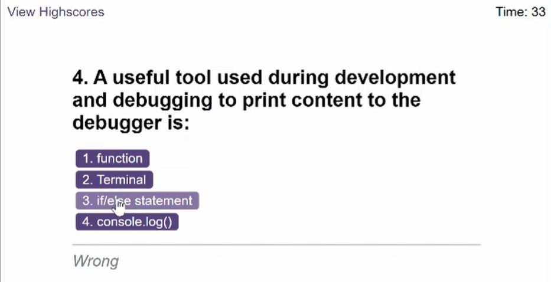
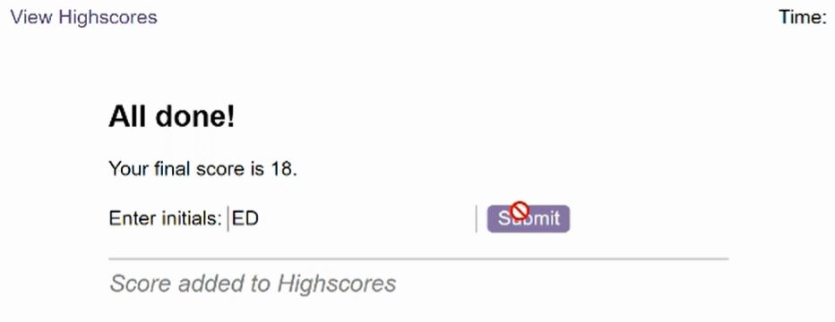

# Code-Quiz

## Description

I wanted to create a code quiz to help students test their knowledge under coding assessment conditions to replicate what that they will face as part of the interview process to land their first role in tech. 

This has been achieved by:
* Creating a timed quiz
* Displaying a question with multiple choice answers - once the question is answered, the next question & answers are displayed.
* If an incorrect answer is given, a time penalty of 10secs is taken off the timer.
* The quiz finishes when all questions are answered or the timer reaches 0.
* The user can enter their initials to add their score to the Highscores page.
    * The user can clear the highscores page.

    

Clicking correct answer - a 'correct' msg is displayed:

 

 

Clicking wrong answer - a 'wrong' msg is displayed and time is reduced:

Submit button becomes disabled after score is submitted to highscores:

 

## Installation

Please use the following link to access the website: https://e-davies.github.io/Code-Quiz/

## Usage

This application will be used by students looking to test their code knowledge and practice being under coding assessment conditions.
